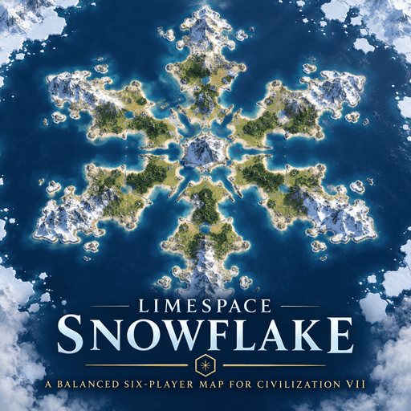
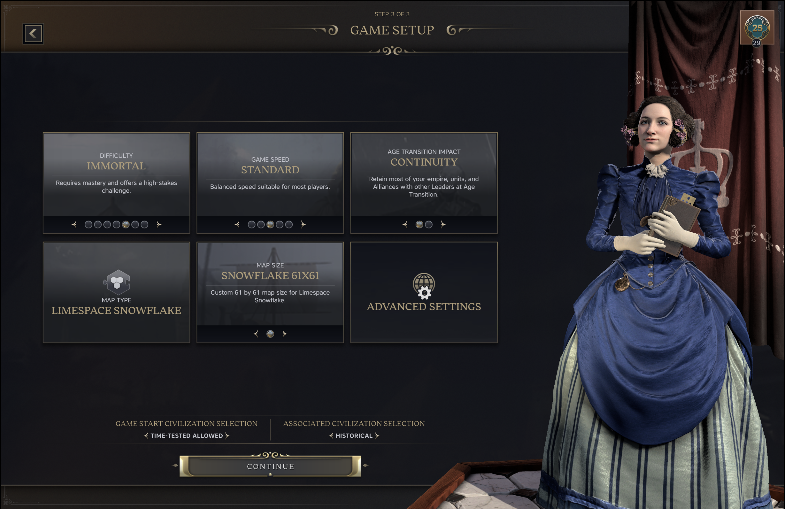
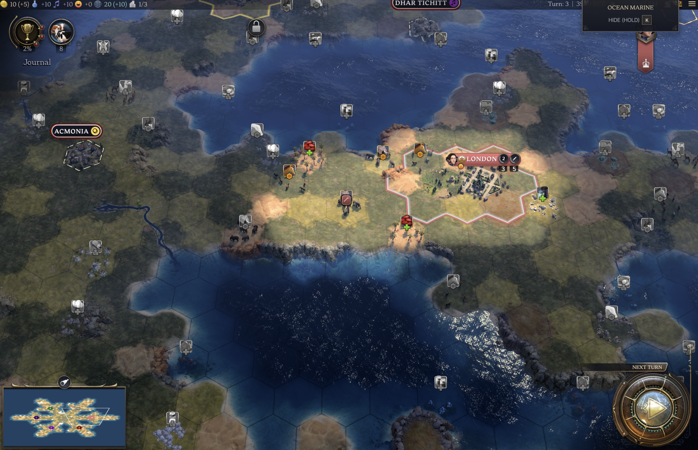
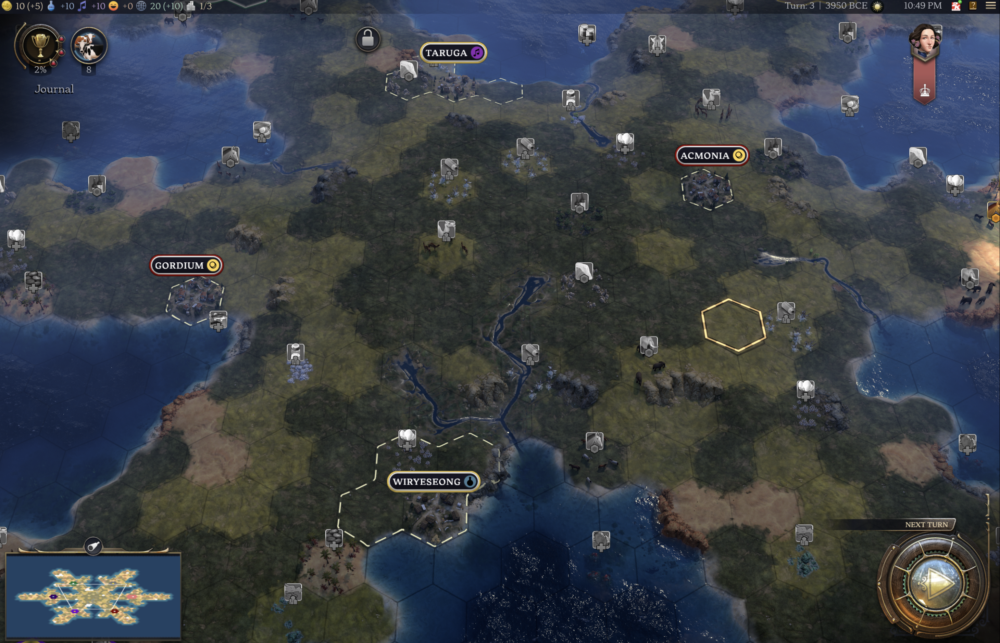

# Limespace Snowflake — Civilization VII Map

# Limespace Snowflake — Civilization VII Map



A custom **61×61 six-player Snowflake map** for **Sid Meier's Civilization VII**.

A custom **61×61 six-player Snowflake map** for **Sid Meier's Civilization VII**.

The map was designed using my browser-based **Civ VII Map Editor**, then exported and integrated into Civilization VII as a standalone map mod.

## Features

- Custom 61×61 map size
- Six-way symmetrical Snowflake layout
- Six fixed player starting positions
- Custom terrain and biome import
- Hills and mountains
- Forest placement
- Procedurally generated rivers
- Procedurally generated resources
- Floodplains and fertility generation
- Custom Civ VII map configuration
- Designed for six-player games

## Map Design

The Snowflake layout is built around six symmetrical arms extending from a central region.

Each player begins on a separate arm, creating a balanced multiplayer-style layout while the central area acts as a natural contested zone.

The overall geography is fixed, while rivers and resources are generated by Civilization VII each game to improve replayability.

## Screenshots

### Snowflake Map



### In-Game Map



### Gameplay



## Civ VII Map Editor

The map layout was created using my browser-based Civ VII Map Editor.

Live editor:

https://joakim-silva.github.io/civ7-map-editor/

Source code:

https://github.com/joakim-silva/civ7-map-editor

## Project Structure

```text
civ7-snowflake-map/
├── config/
├── data/
├── maps/
├── text/
├── limespace_snowflake.modinfo
├── README.md
└── .gitignore
